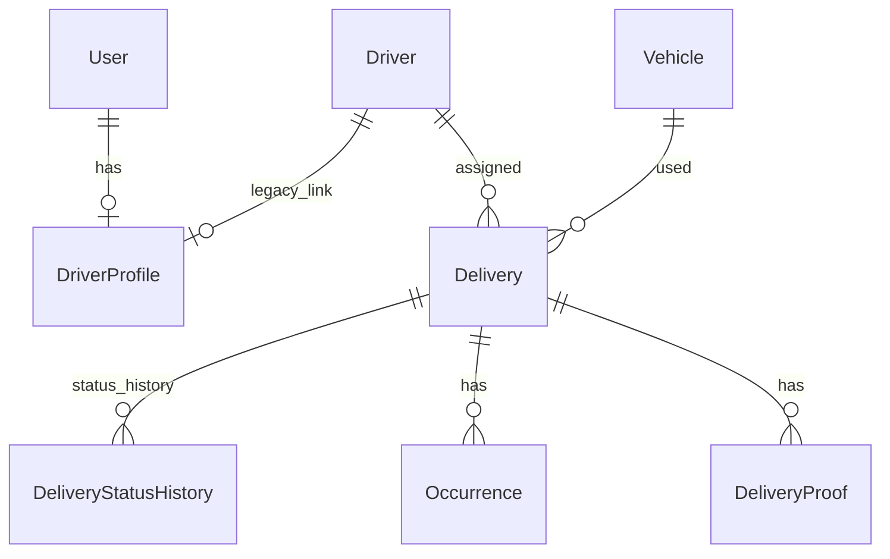
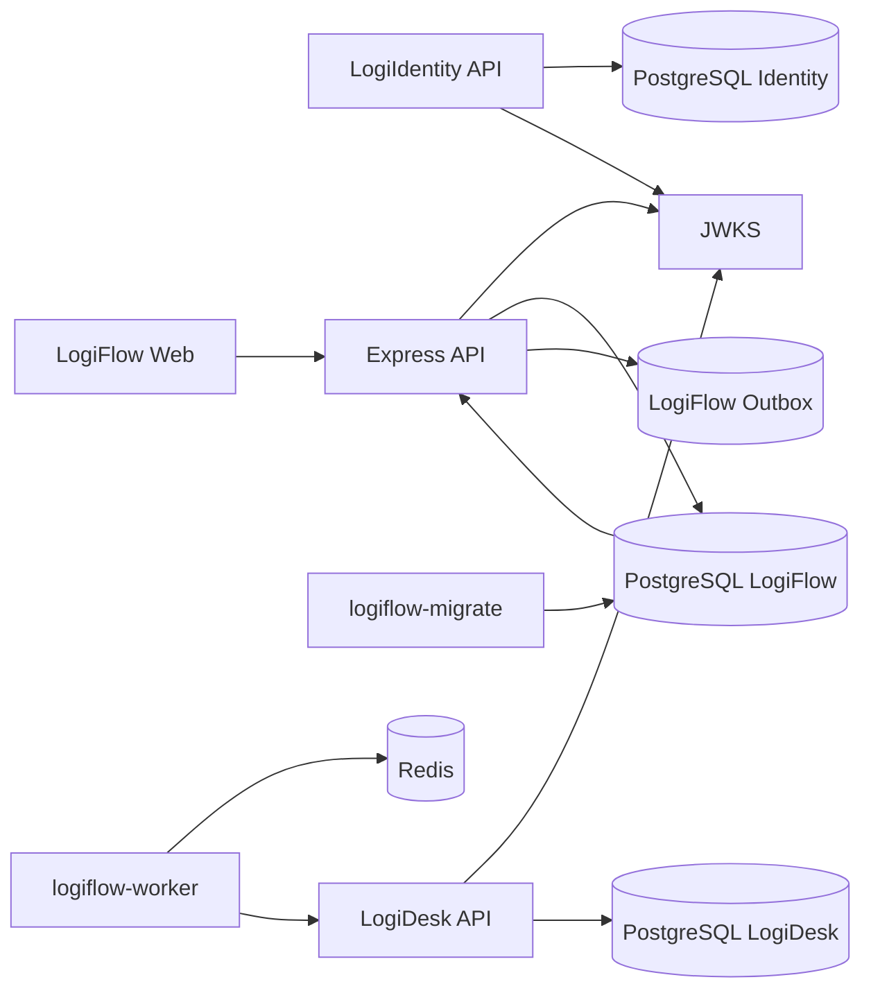

# Architecture

## Visao geral

O repositorio funciona como uma plataforma em transicao. O LogiIdentity agora existe como servico separado para login, sessoes, roles, permissoes, JWT RS256 e JWKS. O LogiFlow ainda vive na raiz, com frontend Next.js e API Express. O LogiPeople segue uma estrutura de monorepo mais clara, em `apps/`, `packages/` e `databases/`. O LogiDesk possui uma fundacao propria em `apps/logidesk-*` e `databases/logidesk`, mas ainda nao representa o produto empresarial completo descrito no prompt mestre.

## LogiIdentity

```text
apps/identity-api       NestJS API de identidade
apps/identity-worker    Worker bootstrap conectado ao Redis
databases/identity      Prisma separado
```

Padroes atuais:

- Identity e a fonte de tokens novos da plataforma.
- Access token JWT RS256 com `kid`, `iss`, `aud`, `roles`, `permissions` e `sessionId`.
- JWKS em `/.well-known/jwks.json`.
- Refresh token opaco em cookie HttpOnly, persistido apenas como hash.
- LogiFlow e LogiDesk validam tokens Identity por JWKS.

## LogiFlow

```text
app/             Frontend Next.js App Router
src/server.ts    Bootstrap da API Express
src/routes.ts    Registro central de rotas
src/controllers  Controllers HTTP
src/middlewares  Auth, API key, RBAC e depreciacao
src/lib          Prisma, tokens, erros, logger e observabilidade
prisma/          Schema e migrations
```

Padroes atuais:

- Controllers ainda concentram parte de validacao, regra de negocio e acesso Prisma.
- Rotas v1 novas convivem com rotas legadas depreciadas.
- Identidade versionada local ainda existe para compatibilidade, mas tokens Identity sao aceitos via JWKS quando `IDENTITY_JWKS_URL` esta configurada.
- Driver ownership e resolvido por `JWT sub -> User -> DriverProfile -> driverId`.
- Endpoints operacionais exigem `ADMIN` ou `OPERATOR`.

## LogiPeople

```text
apps/logipeople-api       NestJS modular
apps/logipeople-web       Next.js App Router
apps/logipeople-worker    Worker bootstrap
databases/logipeople      Prisma separado
packages/auth             Tipos de identidade
packages/contracts        Zod HTTP contracts
packages/event-contracts  Zod event contracts
packages/config           Env/config helpers
packages/logger           Logger compartilhado
```

Padroes atuais:

- API modular por dominio.
- Guards para JWT, RBAC, ABAC e field access.
- Contratos Zod compartilhados em `packages/contracts`.
- Banco separado do LogiFlow.

## LogiDesk

```text
apps/logidesk-api       NestJS API fundacional de tickets
apps/logidesk-web       Next.js App Router para dashboard, tickets, SLA e configuracoes
apps/logidesk-worker    Worker BullMQ fundacional
databases/logidesk      Prisma separado
```

Padroes atuais:

- API modular com `HealthModule` e `TicketsModule`.
- Banco PostgreSQL separado, sem relacoes Prisma com LogiFlow.
- Endpoint service-to-service `POST /api/v1/tickets/from-logiflow` protegido por `x-service-token`.
- Criacao de ticket idempotente por `idempotency-key`.
- Ticket cria historico, SLA preliminar, auditoria e outbox local.
- Worker BullMQ sobe e conecta no Redis, mas o processamento distribuido completo ainda e pendente.

## Bancos

Identity, LogiFlow, LogiPeople e LogiDesk possuem schemas Prisma separados. Nao ha relacoes Prisma entre bancos.



## Runtime LogiFlow



## CI/CD

Workflows:

- `identity-ci.yml`: Identity API, worker, Prisma, testes e build.
- `logiflow-ci.yml`: LogiFlow, Docker e smoke test.
- `logipeople-ci.yml`: LogiPeople e pacotes compartilhados.
- `logidesk-ci.yml`: LogiDesk API/web/worker, Prisma e Docker.
- `integration-ci.yml`: verificacao completa de plataforma.

## Pendencias arquiteturais

- Extrair regras de controllers LogiFlow para services/use cases.
- Migrar consumidores antigos para Identity e remover autenticacao duplicada somente apos validacao.
- Completar o LogiDesk empresarial: equipes, SLA completo, mensagens, notas internas, anexos, relatorios e Socket.IO.
- Completar processamento de Outbox, Redis/BullMQ, DLQ e reprocessamento distribuido.
- Adicionar Socket.IO autenticado.
- Cobrir E2E completo com Playwright.
