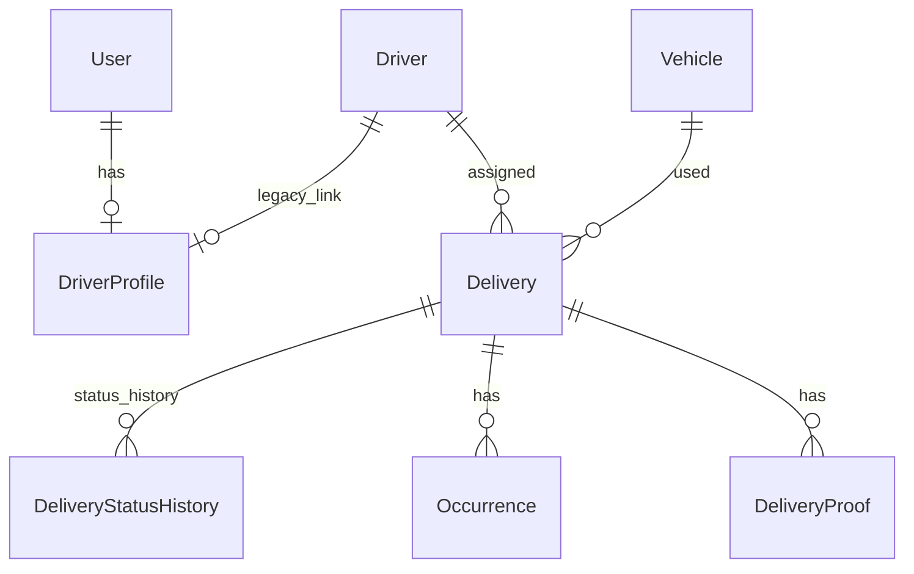
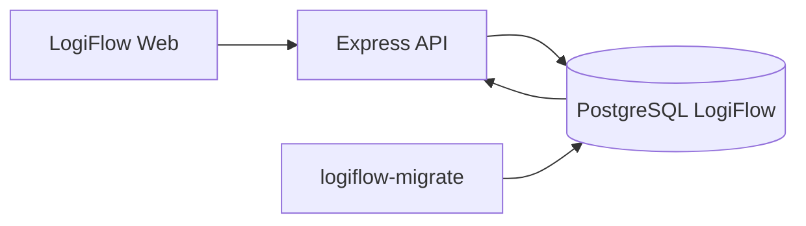

# Architecture

## Visao geral

O repositorio funciona como uma plataforma em transicao. O LogiFlow ainda vive na raiz, com frontend Next.js e API Express. O LogiPeople ja segue uma estrutura de monorepo mais clara, em `apps/`, `packages/` e `databases/`.

LogiDesk nao existe neste checkout. Qualquer integracao com suporte deve ser tratada como contrato futuro, nao como feature pronta.

## LogiFlow

```text
app/             Frontend Next.js App Router
src/server.ts    Bootstrap da API Express
src/routes.ts    Registro central de rotas
src/controllers  Controllers HTTP
src/middlewares  Auth, API key, RBAC e depreciacao
src/lib          Prisma, tokens, erros, logger e observabilidade
prisma/          Schema e migrations
```

Padroes atuais:

- Controllers ainda concentram parte de validacao, regra de negocio e acesso Prisma.
- Rotas v1 novas convivem com rotas legadas depreciadas.
- Identidade versionada usa `User`, `DriverProfile` e `RefreshSession`.
- Driver ownership e resolvido por `JWT sub -> User -> DriverProfile -> driverId`.
- Endpoints operacionais exigem `ADMIN` ou `OPERATOR`.

## LogiPeople

```text
apps/logipeople-api       NestJS modular
apps/logipeople-web       Next.js App Router
apps/logipeople-worker    Worker bootstrap
databases/logipeople      Prisma separado
packages/auth             Tipos de identidade
packages/contracts        Zod HTTP contracts
packages/event-contracts  Zod event contracts
packages/config           Env/config helpers
packages/logger           Logger compartilhado
```

Padroes atuais:

- API modular por dominio.
- Guards para JWT, RBAC, ABAC e field access.
- Contratos Zod compartilhados em `packages/contracts`.
- Banco separado do LogiFlow.

## Bancos

LogiFlow e LogiPeople possuem schemas Prisma separados. Nao ha relacoes Prisma entre bancos.



## Runtime LogiFlow



## CI/CD

Workflows:

- `logiflow-ci.yml`: LogiFlow, Docker e smoke test.
- `logipeople-ci.yml`: LogiPeople e pacotes compartilhados.
- `integration-ci.yml`: verificacao completa de plataforma.

## Pendencias arquiteturais

- Extrair regras de controllers LogiFlow para services/use cases.
- Criar LogiDesk real ou importar sua base.
- Implementar Outbox, Redis/BullMQ, DLQ e reprocessamento distribuido.
- Adicionar Socket.IO autenticado.
- Cobrir E2E completo com Playwright.
