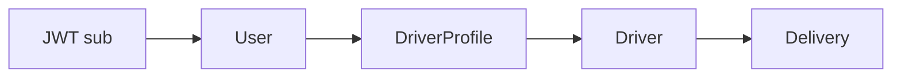

# Authorization

## Papeis LogiFlow

Papeis usados no fluxo versionado:

- `ADMIN`
- `OPERATOR`
- `DRIVER`
- `SUPPORT`
- `CUSTOMER`

No checkout atual, os endpoints operacionais implementados exigem `ADMIN` ou `OPERATOR`. Os endpoints de motorista usam ownership por perfil.

## Ownership do motorista

Fluxo:

Regras:

- Motorista ve apenas entregas vinculadas ao seu `DriverProfile.driverId`.
- Motorista sem perfil recebe `403`.
- Entrega inexistente recebe `404`.
- Entrega de outro motorista recebe `403 OWNERSHIP_REQUIRED`.
- Status invalido recebe `422 INVALID_STATUS_TRANSITION`.

## Operacao LogiFlow

Endpoints em `/api/v1/operations/*` exigem:

- Token v1 valido.
- Role `ADMIN` ou `OPERATOR`.

## LogiPeople

LogiPeople combina:

- RBAC por roles.
- ABAC por escopo de empresa/departamento quando aplicavel.
- Field access para dados sensiveis.

Analytics agregado permite perfil `AUDITOR`, mas continua sem dados individuais sensiveis.

## Riscos que devem ser testados

- IDOR em entregas.
- Suporte alterando entrega diretamente.
- Motorista acessando entrega alheia.
- Cliente acessando recurso alheio.
- Token com issuer/audience invalido.
- Reuso de refresh token.
- Logs contendo token ou senha.
