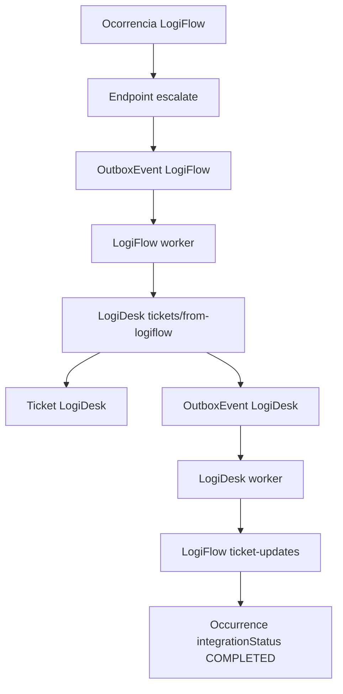

# Integration

Data: 2026-07-14

## Estado Atual

A integracao LogiFlow -> LogiDesk possui outbox persistida e dispatcher HTTP no `logiflow-worker`.
O retorno LogiDesk -> LogiFlow tambem possui dispatcher HTTP no `logidesk-worker` para eventos vinculados a ocorrencias.

Componentes:

- LogiFlow `POST /api/v1/operations/occurrences/:id/escalate`.
- `OutboxEvent` e `DeadLetterEvent` no banco LogiFlow.
- Evento `logiflow.occurrence.escalated`.
- `apps/logiflow-worker` com polling da outbox no PostgreSQL.
- LogiDesk `POST /api/v1/tickets/from-logiflow`.
- `IdempotencyRecord`, `OutboxEvent`, `DeadLetterEvent` e `AuditLog` no banco LogiDesk.
- LogiFlow `POST /api/v1/integrations/logidesk/ticket-updates`.
- Workers `apps/logiflow-worker` e `apps/logidesk-worker`.
- Redis no Docker Compose para filas BullMQ existentes.

## Fluxo Implementado

## Dispatcher LogiFlow

O `logiflow-worker`:

1. busca eventos `PENDING` ou `FAILED` elegiveis na tabela `OutboxEvent`;
2. bloqueia o registro com `FOR UPDATE SKIP LOCKED`;
3. marca o evento como `PROCESSING`;
4. envia `POST /api/v1/tickets/from-logiflow`;
5. envia `x-service-token`, `idempotency-key` e `x-correlation-id`;
6. marca sucesso como `COMPLETED`;
7. publica uma copia operacional em Redis Stream `logiflow.events`;
8. marca falha temporaria como `FAILED`;
9. envia falha permanente ou excesso de tentativas para `DeadLetterEvent`;
10. publica falhas e DLQ no mesmo stream com `status`.

Eventos `FAILED` usam backoff exponencial calculado por `attempts` e `updatedAt`, sem criar coluna extra de agenda. Por padrao o atraso inicia em 30 segundos e cresce ate 900 segundos. O worker registra `retryDelaySeconds` nos logs de falha.

Variaveis:

- `DATABASE_URL`
- `LOGIDESK_API_URL`
- `LOGIDESK_SERVICE_TOKEN`
- `LOGIFLOW_OUTBOX_POLL_INTERVAL_MS`
- `LOGIFLOW_OUTBOX_MAX_ATTEMPTS`
- `LOGIFLOW_OUTBOX_RETRY_BASE_DELAY_SECONDS`
- `LOGIFLOW_OUTBOX_RETRY_MAX_DELAY_SECONDS`
- `LOGIFLOW_EVENT_STREAM`
- `EVENT_STREAM_MAXLEN`

## Dispatcher LogiDesk

O `logidesk-worker`:

1. busca eventos `PENDING` ou `FAILED` elegiveis na tabela `OutboxEvent` do LogiDesk;
2. bloqueia o registro com `FOR UPDATE SKIP LOCKED`;
3. marca o evento como `PROCESSING`;
4. ignora com sucesso eventos sem `occurrenceId`/`ticketNumber`, pois nao pertencem ao LogiFlow;
5. envia `POST /api/v1/integrations/logidesk/ticket-updates` quando o ticket tem referencia logistica;
6. envia `x-service-token` e `x-correlation-id`;
7. marca sucesso como `COMPLETED`;
8. publica uma copia operacional em Redis Stream `logidesk.events`;
9. marca falha temporaria como `FAILED`;
10. envia falha permanente ou excesso de tentativas para `DeadLetterEvent`;
11. publica falhas e DLQ no mesmo stream com `status`.

Eventos `FAILED` usam o mesmo backoff exponencial por `attempts` e `updatedAt`. O worker registra `retryDelaySeconds` nos logs de falha para facilitar investigacao.

## DLQ e Reprocessamento

LogiFlow e LogiDesk expoem operacao administrativa inicial para DLQ.

LogiFlow:

- `GET /api/v1/operations/dead-letter-events`
- `POST /api/v1/operations/dead-letter-events/:id/reprocess`

Essas rotas exigem JWT v1 com roles `ADMIN` ou `OPERATOR`. O reprocessamento valida que existe `outboxEventId`, confirma que o `OutboxEvent` vinculado ainda esta em `DEAD_LETTER`, reseta o outbox para `PENDING`, zera tentativas, limpa erro/processamento e, quando o payload possui `occurrenceId`, recoloca a ocorrencia em `PENDING`.

LogiDesk:

- `GET /api/v1/dead-letter-events`
- `POST /api/v1/dead-letter-events/:id/reprocess`

Essas rotas exigem `x-service-token` ate o RBAC completo do LogiDesk ser aplicado. O reprocessamento nao apaga o registro de `DeadLetterEvent`. Ele valida que existe `outboxEventId`, confirma que o `OutboxEvent` vinculado ainda esta em `DEAD_LETTER`, reseta o outbox para `PENDING`, zera tentativas, limpa o ultimo erro e registra auditoria. O worker volta a capturar o registro no proximo ciclo de polling.

Variaveis:

- `LOGIDESK_DATABASE_URL`
- `LOGIFLOW_API_URL`
- `LOGIDESK_SERVICE_TOKEN`
- `LOGIDESK_OUTBOX_POLL_INTERVAL_MS`
- `LOGIDESK_OUTBOX_MAX_ATTEMPTS`
- `LOGIDESK_OUTBOX_RETRY_BASE_DELAY_SECONDS`
- `LOGIDESK_OUTBOX_RETRY_MAX_DELAY_SECONDS`
- `LOGIDESK_EVENT_STREAM`
- `EVENT_STREAM_MAXLEN`

## Contratos

Eventos distribuidos devem usar `packages/event-contracts`.

Nomes atuais:

- `logiflow.occurrence.escalated`
- `logidesk.ticket.created`
- `logidesk.ticket.status_changed`
- `logidesk.ticket.message_created`
- `logidesk.ticket.resolved`

Nomes legados ainda encontrados no codigo ou dados antigos:

- `logiflow.occurrence_escalated`
- `ticket.created`
- `ticket.updated`

Esses nomes antigos devem ser aceitos apenas durante migracao e removidos depois de nao haver eventos pendentes.

## Regra Absoluta

Nunca considerar integracao concluida apenas porque uma API retornou HTTP 200.

Para marcar integracao como pronta, confirmar:

- persistencia nos dois bancos;
- evento salvo na Outbox;
- evento processado pelo worker;
- consumidor idempotente;
- atualizacao de status no emissor;
- logs correlacionados;
- teste de falha e recuperacao;
- E2E completo.

## Limites Atuais

- O dispatcher ainda usa polling PostgreSQL como mecanismo principal de entrega; Redis Streams recebe copia operacional dos eventos processados, falhos e enviados para DLQ.
- Backoff progressivo existe no polling de `FAILED`.
- LogiFlow e LogiDesk possuem API administrativa inicial para listar DLQ e reprocessar outbox em `DEAD_LETTER`; falta validar reprocessamento fim a fim com containers.
- Socket.IO distribuido ainda nao foi conectado.
- E2E completo ainda nao foi automatizado.
