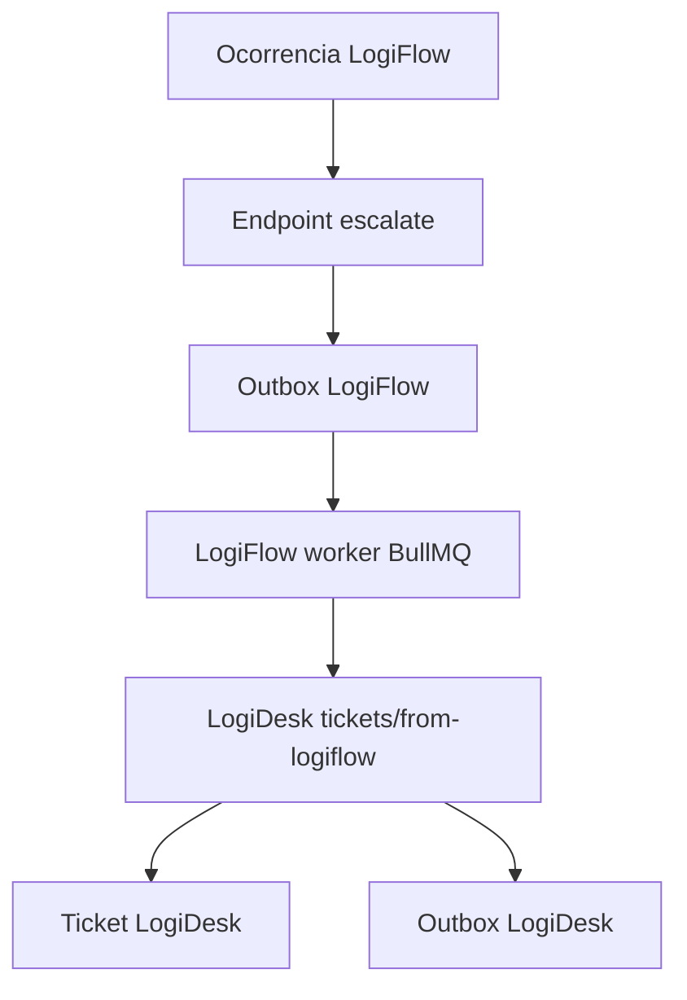

# Integration

## Estado atual

A fundacao da integracao LogiFlow -> LogiDesk foi criada.

Componentes:

- LogiFlow `POST /api/v1/operations/occurrences/:id/escalate`.
- `OutboxEvent` e `DeadLetterEvent` no banco LogiFlow.
- Contrato `logiflow.occurrence_escalated` em `packages/event-contracts`.
- LogiDesk `POST /api/v1/tickets/from-logiflow`.
- `IdempotencyRecord`, `OutboxEvent`, `DeadLetterEvent`, `AuditLog` no banco LogiDesk.
- Workers `apps/logiflow-worker` e `apps/logidesk-worker` com BullMQ/Redis.
- Redis no Docker Compose.

## Fluxo implementado

## Contratos

- `logiflow.occurrence_escalated`
- `ticket.created`
- `ticket.updated`

Todos devem carregar:

- `eventId`
- `eventType`
- `eventVersion`
- `occurredAt`
- `correlationId`
- payload validado por Zod

## Regra absoluta

Nunca considerar integracao concluida apenas porque uma API retornou HTTP 200.

Para marcar integracao como pronta, confirmar:

- persistencia nos dois bancos;
- evento salvo na Outbox;
- evento publicado;
- consumidor processou;
- idempotencia;
- status sincronizado;
- logs correlacionados;
- teste de falha e recuperacao;
- E2E completo.

## Limites atuais

- O worker ainda nao faz dispatch HTTP real da outbox para LogiDesk.
- Retry/backoff e DLQ existem como estrutura, mas precisam de processamento completo.
- Socket.IO distribuido ainda nao foi conectado.
- E2E completo ainda nao foi automatizado.
