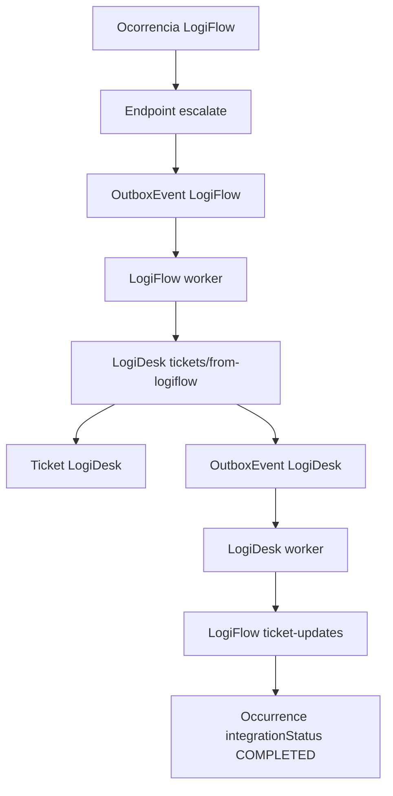

# Integration

Data: 2026-07-14

## Estado atual

A integração LogiFlow -> LogiDesk possui outbox persistida e dispatcher HTTP no `logiflow-worker`.
O retorno LogiDesk -> LogiFlow também possui dispatcher HTTP no `logidesk-worker` para eventos vinculados a ocorrências.

Componentes:

- LogiFlow `POST /api/v1/operations/occurrences/:id/escalate`.
- `OutboxEvent` e `DeadLetterEvent` no banco LogiFlow.
- Evento `logiflow.occurrence.escalated`.
- `apps/logiflow-worker` com polling da outbox no PostgreSQL.
- LogiDesk `POST /api/v1/tickets/from-logiflow`.
- `IdempotencyRecord`, `OutboxEvent`, `DeadLetterEvent` e `AuditLog` no banco LogiDesk.
- LogiFlow `POST /api/v1/integrations/logidesk/ticket-updates`.
- Workers `apps/logiflow-worker` e `apps/logidesk-worker`.
- Redis no Docker Compose para filas BullMQ existentes.

## Fluxo implementado

## Dispatcher LogiFlow

O `logiflow-worker`:

1. busca eventos `PENDING` ou `FAILED` na tabela `OutboxEvent`;
2. bloqueia o registro com `FOR UPDATE SKIP LOCKED`;
3. marca o evento como `PROCESSING`;
4. envia `POST /api/v1/tickets/from-logiflow`;
5. envia `x-service-token`, `idempotency-key` e `x-correlation-id`;
6. marca sucesso como `COMPLETED`;
7. marca falha temporária como `FAILED`;
8. envia falha permanente ou excesso de tentativas para `DeadLetterEvent`.

Variáveis:

- `DATABASE_URL`
- `LOGIDESK_API_URL`
- `LOGIDESK_SERVICE_TOKEN`
- `LOGIFLOW_OUTBOX_POLL_INTERVAL_MS`
- `LOGIFLOW_OUTBOX_MAX_ATTEMPTS`

## Dispatcher LogiDesk

O `logidesk-worker`:

1. busca eventos `PENDING` ou `FAILED` na tabela `OutboxEvent` do LogiDesk;
2. bloqueia o registro com `FOR UPDATE SKIP LOCKED`;
3. marca o evento como `PROCESSING`;
4. ignora com sucesso eventos sem `occurrenceId`/`ticketNumber`, pois não pertencem ao LogiFlow;
5. envia `POST /api/v1/integrations/logidesk/ticket-updates` quando o ticket tem referência logística;
6. envia `x-service-token` e `x-correlation-id`;
7. marca sucesso como `COMPLETED`;
8. marca falha temporária como `FAILED`;
9. envia falha permanente ou excesso de tentativas para `DeadLetterEvent`.

Variáveis:

- `LOGIDESK_DATABASE_URL`
- `LOGIFLOW_API_URL`
- `LOGIDESK_SERVICE_TOKEN`
- `LOGIDESK_OUTBOX_POLL_INTERVAL_MS`
- `LOGIDESK_OUTBOX_MAX_ATTEMPTS`

## Contratos

Eventos distribuídos devem usar `packages/event-contracts`.

Nomes atuais:

- `logiflow.occurrence.escalated`
- `logidesk.ticket.created`
- `logidesk.ticket.status_changed`
- `logidesk.ticket.message_created`
- `logidesk.ticket.resolved`

Nomes legados ainda encontrados no código ou dados antigos:

- `logiflow.occurrence_escalated`
- `ticket.created`
- `ticket.updated`

Esses nomes antigos devem ser aceitos apenas durante migração e removidos depois de não haver eventos pendentes.

## Regra absoluta

Nunca considerar integração concluída apenas porque uma API retornou HTTP 200.

Para marcar integração como pronta, confirmar:

- persistência nos dois bancos;
- evento salvo na Outbox;
- evento processado pelo worker;
- consumidor idempotente;
- atualização de status no emissor;
- logs correlacionados;
- teste de falha e recuperação;
- E2E completo.

## Limites atuais

- O dispatcher usa polling PostgreSQL; Redis Streams ainda não foi adotado para este fluxo.
- Backoff é limitado por polling e contagem de tentativas; agendamento progressivo ainda precisa ser refinado.
- Socket.IO distribuído ainda não foi conectado.
- E2E completo ainda não foi automatizado.
