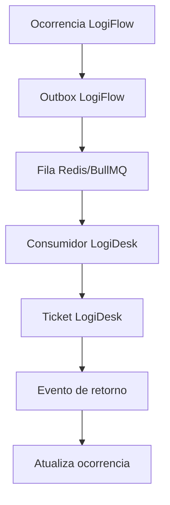

# Integration

## Estado atual

Nao existe integracao real LogiFlow <-> LogiDesk neste checkout porque LogiDesk nao existe.

Tambem nao existem modulos reais de:

- Redis;
- BullMQ;
- Outbox Pattern;
- Dead-letter queue;
- consumidores de eventos LogiFlow/LogiDesk.

## Contratos compartilhados

Pacotes existentes:

- `packages/contracts`: contratos HTTP Zod, atualmente usados principalmente por LogiPeople.
- `packages/event-contracts`: contratos de eventos para evolucao futura.

## Regra absoluta

Nunca considerar integracao concluida apenas porque uma API retornou HTTP 200.

Para marcar integracao como pronta, confirmar:

- persistencia nos dois bancos;
- evento salvo na Outbox;
- evento publicado;
- consumidor processou;
- idempotencia;
- status sincronizado;
- logs correlacionados;
- teste de falha e recuperacao;
- E2E completo.

## Fluxo alvo futuro

## Status

Bloqueado ate existir base LogiDesk ou autorizacao explicita para cria-la do zero.
