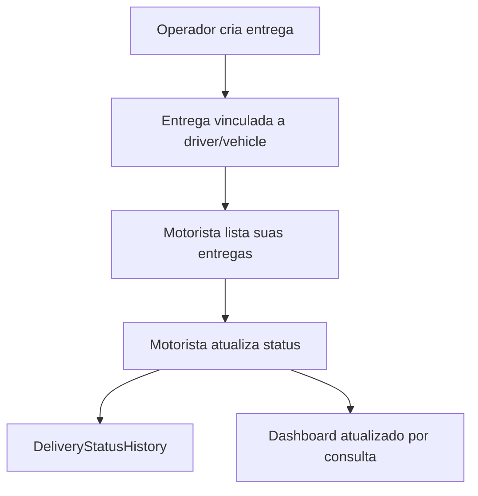

# LogiFlow

## Escopo

LogiFlow e responsavel por operacao logistica:

- motoristas;
- veiculos;
- entregas;
- status operacional;
- ocorrencias;
- comprovantes;
- dashboard;
- app/tela do motorista.

## API atual

Versionada:

- `/api/v1/auth/*`
- `/api/v1/driver/*`
- `/api/v1/dashboard/metrics`
- `/api/v1/operations/*`
- `/api/v1/health/*`
- `/api/v1/metrics`

Legada depreciada:

- `/login`
- `/users`
- `/drivers`
- `/vehicles`
- `/deliveries`
- `/dashboard/metrics`

## Banco

Principais modelos:

- `User`
- `DriverProfile`
- `RefreshSession`
- `Driver`
- `Vehicle`
- `Delivery`
- `DeliveryStatusHistory`
- `Occurrence`
- `DeliveryProof`

## Fluxo de entrega

## Limitacoes atuais

- Nao ha worker LogiFlow.
- Nao ha Outbox real.
- Nao ha Redis/BullMQ.
- Nao ha mapa com ownership completo.
- Nao ha integracao real com LogiDesk.
