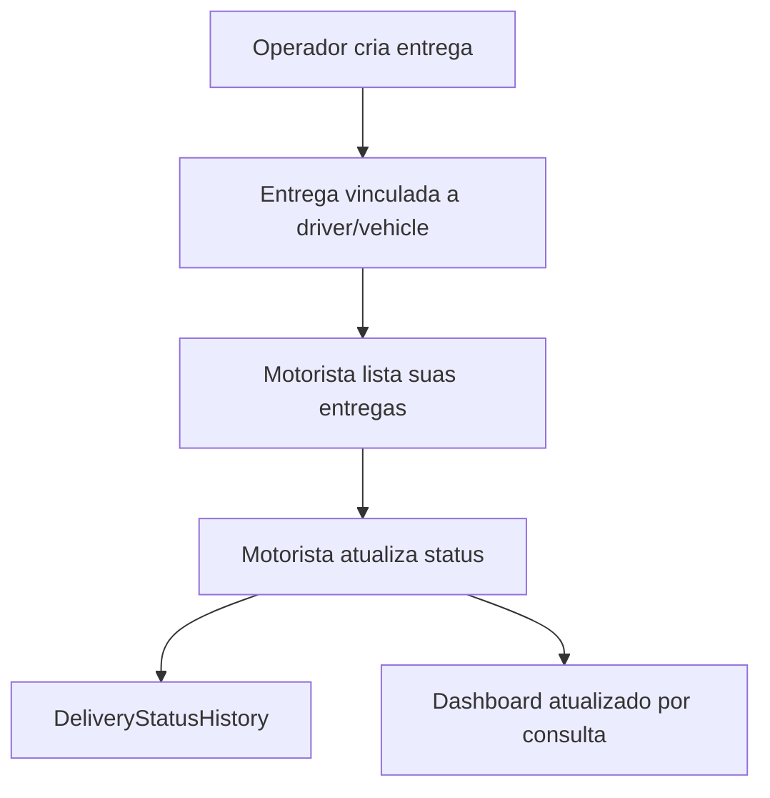

# LogiFlow

## Escopo

LogiFlow e responsavel por operacao logistica:

- motoristas;
- veiculos;
- entregas;
- status operacional;
- ocorrencias;
- comprovantes;
- dashboard;
- app/tela do motorista.

## API atual

Versionada:

- `/api/v1/auth/*`
- `/api/v1/driver/*`
- `/api/v1/dashboard/metrics`
- `/api/v1/operations/*`
- `/api/v1/health/*`
- `/api/v1/metrics`

Legada depreciada:

- `/login`
- `/users`
- `/drivers`
- `/vehicles`
- `/deliveries`
- `/dashboard/metrics`

## Banco

Principais modelos:

- `User`
- `DriverProfile`
- `RefreshSession`
- `Driver`
- `Vehicle`
- `Delivery`
- `DeliveryStatusHistory`
- `Occurrence`
- `DeliveryProof`
- `OutboxEvent`
- `DeadLetterEvent`

## Integracao e DLQ

LogiFlow publica escalonamentos para o LogiDesk por `OutboxEvent`, processado pelo `apps/logiflow-worker`.

Rotas operacionais de recuperacao:

- `GET /api/v1/operations/dead-letter-events`
- `POST /api/v1/operations/dead-letter-events/:id/reprocess`

As duas exigem JWT v1 e roles `ADMIN` ou `OPERATOR`. O reprocessamento recoloca o outbox vinculado em `PENDING` e, quando o payload possui `occurrenceId`, tambem recoloca a ocorrencia em `PENDING`.

## Fluxo de entrega

## Limitacoes atuais

- O worker LogiFlow existe e despacha outbox por HTTP, mas Redis Streams ainda nao foi adotado nesse fluxo.
- DLQ operacional existe como endpoint inicial; falta validar reprocessamento fim a fim com containers.
- Nao ha mapa com ownership completo.
- E2E completo LogiFlow -> LogiDesk ainda nao foi automatizado.
